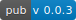

# [toasty](https://pub.dartlang.org/packages/toasty)
[](https://pub.dartlang.org/packages/toasty)

A Flutter Library For Show Toast In Android And Ios
> Supported Platforms
>
> - Android
> - IOS

## How Use Toasty 

```yaml
# add the below line to your pubspec.yaml dependencies
fluttertoast: ^3.1.0
```

```dart
// add the below line in your dart code
import 'package:fluttertoast/fluttertoast.dart';
```
```dart
Toasty.showToast(
    message: 'this is a message',
    length: TOAST_LENGTH.LENGTH_SHORT,
    gravity: TOAST_GRAVITY.BOTTOM,
    fontColor: Colors.white,
    backgroundColor: Colors.grey.shade300,
    fontSize: 15,
  );
```
<br/>

### Toasty.showToast() property :
| property        | description                                                        |
| --------------- | ------------------------------------------------------------------ |
| message             | String (required)                                        |
| length     | TOAST_LENGTH.LENGTH_SHORT or TOAST_LENGTH.LENGTH_LONG <br/>(optional but defualt is TOAST_LENGTH.LENGTH_SHORT)                 |
| gravity         | TOAST_GRAVITY.BOTTOM or TOAST_GRAVITY.CENTER or TOAST_GRAVITY.TOP  <br/>(optional but defualt is TOAST_GRAVITY.BOTTOM ) |
| fontColor | Colors.white <br/> (if passing null to fontColor if your device is iOs defualt fontColor is White but if your device is Android your defualt fontColor is Black                                                 |
| backgroundColor         | Colors.grey  <br/> (if passing null to backgroundColor if your device is iOs defualt backgroundColor is Colors.black.withOpacity(0.9) but if your device is Android your defualt backgroundColor is Colors.grey.shade300                                                     |
| fontSize       | 16.0 (double) <br/> (defualt value is 15.0)                                                      |

<br/>

##### if you want to use show success message you can use Toasty.successToast() this function show a green toast with a success icon in left of the text and for error and warning also you can use Toasty.errorToast() and Toasty.warningToast().

### Toasty.successToast() property :
| property        | description                                                        |
| --------------- | ------------------------------------------------------------------ |
| message             | String (required)                                        |
| length     | TOAST_LENGTH.LENGTH_SHORT or TOAST_LENGTH.LENGTH_LONG <br/>(optional but defualt is TOAST_LENGTH.LENGTH_SHORT)                 |
| gravity         | TOAST_GRAVITY.BOTTOM or TOAST_GRAVITY.CENTER or TOAST_GRAVITY.TOP  <br/>(optional but defualt is TOAST_GRAVITY.BOTTOM ) |
| fontColor | Colors.white <br/> (if passing null to fontColor if your device is iOs defualt fontColor is White but if your device is Android your defualt fontColor is Black                                                 |
| fontSize       | 16.0 (double) <br/> (defualt value is 15.0)                                                      |
| iconSize       | the size of the icon in toast (double) <br/> (defualt value is 16.0)                                                      |
| iconColor       | color of the icon in toast <br/> (defualt value is Colors.white)                                                |

this properties also use for Toasty.errorToast() and Toasty.warningToast()
 
<br/>

### To cancel all the toasts call

```dart
Toasty.cancel()
```
<br/>

## Preview Images

                                                                                                                
                                                                                                                
                                                                                                                
                                                                                                                
                                                                                                                
                                                                                                                
 

<br/>

## Functions

```dart
Future<void> cancel();
```

```dart
Future<void> showToast();
```

```dart
Future<void> successToast();
```

```dart
Future<void> errorToast();
```

```dart
Future<void> warningToast();
```


                                                                                                               

